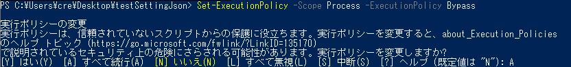
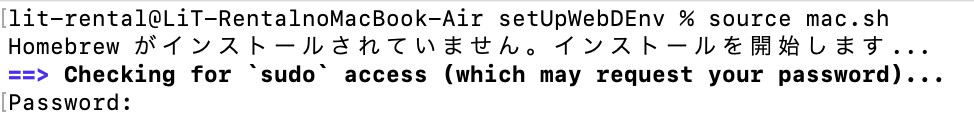
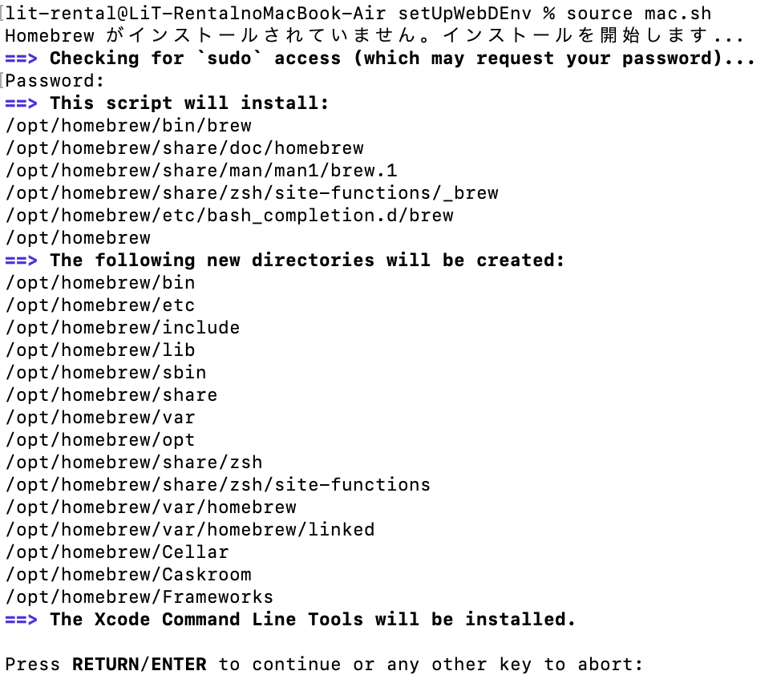

# ファイルの説明

各ファイルの説明と使用方法を記述してます！！

## extension.sh

### 説明

必要な拡張機能や plugin をダウンロードするための shell ファイル

ダウンロードされる物

- homebrew
- vsCode をいじるためのコマンド
- prettier
- liverServer

全てのダウンロードが終了すると "すべての処理が完了しました！"というメッセージが流れます

### 実行方法

#### 💻windows の場合 💻

powershell の**管理者権限**でファイル直下まで移動してください！

例：
`cd Desktop/setUpWebDEnv`

以下のコマンドを実行してください！↓

`Set-ExecutionPolicy -Scope Process -ExecutionPolicy Bypass`

こんなメッセージが表示されると思います！！

↓

`A` を入力して`Enter`を押してください！！

↓

`.¥windows.ps1`

こんなメッセージが表示されたら成功です！

Notes: 処理が止まった場合は Enter を押したら進みます！！

#### 🍎mac の場合 🍎

`sh mac.sh`

↓

コマンドを実行したら以下のようにパソコンのパスワードを聞かれるので入力してください！

↓

このようなメッセージが表示されたら Enter を教えてください！

↓

こんなメッセージが表示されたら成功です！

## settings.json

### 説明

各プロジェクトごとにコードを綺麗に整理整頓してくるコード(設定を workspace に変える必要があります！)

例：

- タブを押した時のスペースの数
- 一番下の行に改行を入れるなどなど
